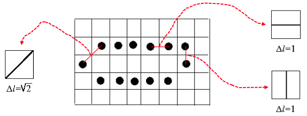
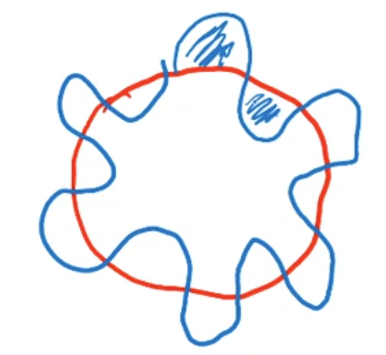
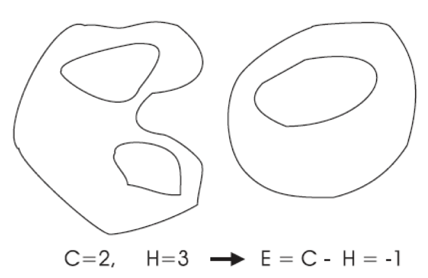

# Blob analysis

We have seen how to perform a foreground/background segmentation, and how to improve its output by simple tools such as morphology operators. Opening/Closing in particular allow us to significantly improve the output of the segmentation. But now, what we're left with is an image having *several objects* with all their pixels marked in *black* (nothing else than a foreground label) and all the other pixels marked as *white* (label denoting the background). Obviously, these labels could be different, maybe 0/1.

The next task would be the analysis of the individual foreground objects, to achieve some kind of high-level knowledge on the scene. The process of analyzing the single objects is called **blob analysis**: it starts with a background/foreground image, and has the goal of understanding what we need about the individual objects.

Such knowledge might be detecting the type of object, taking measurements on the dimensions and their orientation, assessing defects or inaccuracies... Blob stands for **Binary Large Objects**, which first need to be isolated. This first step is called *connected components labeling*.

The properties that we extract once we have found the blobs are typically known as **features**. Sometimes we only need the contour: in such a case, we are looking for **contour features**. How do we extract these? Obviously, through an erosion, getting us the inner contour, then we take the original image and subtract it. Now, there's many features and we'll just discover a small set of them.

Shape features must be invariant to the transformation that the object might undergo when they are image in the system. For example, having an elliptical object, we would expect that if we compute a feature highlighting how much this object resembles an ellipsis, we might get a high score, but we would like is that if the object appears rotated the result doesn't change. 

So, we can now label the objects, maybe by using *pseudocolors* showing what an object is labeled with. 

Each connected component will now be assumed to correspond to a single entity, analyzed separately. We need to define exactly what these connected components are. To do so, let's define connectivity, which is related to the notion of *distance* on the discrete plane $E^2$. 

The distance on the discrete plane, given 3 points $p_1,p_2,p_3$ we say that a function is a distance if it is non-negative for each pair, $0$ only if two points are the same, it is symmetric ($D(p_1, p_2)=D(p_2,p_1)$) and finally: $D\left(p_{1}, p_{3}\right) \leq D\left(p_{1}, p_{2}\right)+D\left(p_{2}, p_{3}\right)$.

The city-block distance, $D_4$ is defined as:
$$
D_{4}\left(p_{1}, p_{2}\right)=\left|i_{1}-i_{2}\right|+\left|j_{1}-j_{2}\right|
$$
basically a distance in which you can't travel diagonally.

Now, the set of points having a distance minor than a threshold, is a rhombus with diagonals of length $2r+1$.

Differenlty, we could define the *Chessboard distance* as:
$$
D_{8}\left(p_{1}, p_{2}\right)=\max \left(\left|i_{1}-i_{2}\right|,\left|j_{1}-j_{2}\right|\right)
$$
This means that unlike the Manhattan distance, you can also move diagonally, and a step along the diagonal would have the same length as an horizontal/vertical step. Indeed, the set of points having distance minor than a threshold, is a square with size $2r+1$. The set of neighbours of $p$ such that $D_8=1$ is called the *8-neighbourhood* of $p$ (think about MineSweeper!).

Now, given a pixel $p$ (point in the frame), a **path** from $p$ to pixel $q$ is a sequence of points such that for every pair of successive points, they are neighbours.

Now, given this notion, we say that a set of pixels are a connected region if, for any 2 pixels $p,q$ in $R$ there always exists a path contained in $R$. There's always at least a path connecting $p$ and $q$. 

Depending on the choice of distance, we can say that $R$ is *4-connected* or *8-connected*.

Now, we can define a *connected foreground region* if it is a connected region and includes foreground pixels only. Likewise, we can define a connected background region. 

A **connected component** of a binary image is a **maximal** connected foreground region: you cannot add points, that's the maximal size.

What matters in labeling algorihtms is **speed**.

The classical **2-scans algorithm** is a sequential algorithm.

The algorithm (raster scan) starts scanning the image, and when it finds a **foreground pixel** it assigns a temporary label. If something is already labeled, it labels its neighbours. We may incur in a situation in which two labels are adjacent. This is why we need a second scan: we'll handle these conflicts during the second scan.

Upon the first scan, different blobs certainly have been given different labels, though, depending on the shape, a single blob might have been labeled differently inside its pixels. 

To handle that problem and come up with a unique labeling, we can do a second scan, allowing a unique final label to be assigned to those parts belonging to the same blob that had been given different temporary labels. 

We run the first scan, record the equivalences, find the equivalent class and then relabel the final image with a unique label taken from each of the equivalent classes found in the processing that takes place between the two scans.

For example, focusing on 4-connectivity, given the raster scan order, if $x$ is a foreground pixel, the already visited neighbours are $p$ and $q$. In the first scan, we'll label $x$ based on the labels we already gave to $p$ and $q$. If both of them are labeled as background, $x$ is a foreground pixel though its neighbours are background pixels. If this is the case, we assign it a new label and increment the label counter. If $q$ has been given a label, while $p$ is background? $x$ shall have the same label as $q$. Likewise, if the already labeled one is $p$, then $x$ will have its label. If both $p$ and $q$ are labeled equally, we use it.

**But**, if $p$ and $q$ are labeled, and they're labeled differently, what shall we label $x$? Because of the existence of $x$, then the labels in $p$ and $q$ are equivalent! We'll give to $x$ either one of the labels, and somehow record that $l_p$ and $l_q$ are indeed the same label! 

## Blob features

There's lots of algorithms that perform blob analysis differing in speed, mainly. 

Once blobs have been found, we can focus on each of these and try to compute their properties(features). What kind of features? There's many kinds, related to the size, the shape... We'll discuss some of them.

### Area and barycentre

The first ones will be **area** and **barycentre**. The **area** is just the **number of pixels of a blob**: $A=\sum_{p \in R} 1$. Then, quite related to it is the **barycentre**, being computed by usingthe two coordinates $i_b, j_b$: 
$$
p=\left[\begin{array}{c}
i \\
j
\end{array}\right] \rightarrow B=\left[\begin{array}{c}
i_{b} \\
j_{b}
\end{array}\right]: i_{b}=\frac{1}{A} \sum_{p \in R} i ; j_{b}=\frac{1}{A} \sum_{p \in R} j
$$

### Perimeter

Another useful feature is the **perimeter**, i.e. the length of the contour. We first have to get what pixels belong to the contour, using the concept of connectivity. A pixel $p$ belongs to the contour if there exists at least **a background pixel** in its neighbourhood. We can decide to rely on 4-connectivity (manhattan distance) or 8-connectivity.
$$
P_{8}=\sum_{p \in C_{4}} 1 \hspace{50px} P_{4}=\sum_{p \in C_{8}} 1
$$

Note that the 4 and 8 are **inverted**: if the connectivity is 4-connected, the perimeter is said of length 8. Considering a blob, and finding $C_4$ then $C_8$, the first one is the contour found if we rely on 4-connectivity. Under this assumption, the length of $P_8$ (the $C_4$ perimeter), it will be higher than the one calculated using $C_8$:

To solve this, we could average them: $\widetilde{P}=\frac{P_{4}+P_{8}}{2}$.

A better estimation of the contour length is finding the $P_8$ and taking into account the *ideal curve* joining two nearby pixels. Given the order of pixels, when counting how much we should weigh each pixel, we check whether the ideal curve joining two consequent pixels is vertical/horizontal or diagonal:

We can formalize it as: *for each pixel, we add 1 if the curve is horizontal/vertical, and we add $\sqrt{2}$ if it is diagonal*.
$$
\begin{array}{l}
C_{4}=\left\{p_{1}, p_{2} \ldots p_{m}\right\} \\
\widetilde{P}_{8}=\sum_{p_{k}: P_{k+1} \in n_{4}\left(p_{k}\right)}+\sum_{p_{k}: p_{k+1} \in\left(n_{8}\left(p_{k}\right)-n_{4}\left(p_{k}\right)\right)} \sqrt{2}
\end{array}
$$
This is probably the best approach to compute perimeters.

If a blob has *holes*, we have to find both of the perimeters. 

### Compactness 

Now another type of feature, a **shape** one, very useful to characterize the blob's shape: the **compactness** (aka Form Factor, P square over A). The computing is simple, you take the squared perimeter divided by the area. In case of continuous 2D shapes, it takes the minimum value (i.e. $4\pi$) for a circle.

Taking a circle as example, we draw another shape over it:

Assuming the *inner* concavities have the same area of the *outer* concavities, the blue areas are equal to the red ones, although the perimeter will be much longer than the circle one. So, clearly, this measure is **higher** for shapes showing **many concavities**!
$$
C=\frac{P^2}{A}
$$
Note that we want shape features to be *scale-invariant*.

### Haralick circularity

Another researcher did show however that compactness is minimum for a circle, in practice, due to quantization issues, this is not the case for **digital shapes**, i.e. quantized ones, where the minimum is defined by an octagon or a diamond (basing on 4-connectivity of 8). This guy, named *Haralick*, proposed another circularity feature:
$$
C=\left\{p_{1}, p_{2} \ldots p_{m}\right\}, \quad \underline{p_{k}}=\left[\begin{array}{c}
i_{k} \\
j_{k}
\end{array}\right], B=\left[\begin{array}{c}
i_{b} \\
j_{b}
\end{array}\right], d_{k}=\sqrt{\left(i_{k}-i_{b}\right)^{2}+\left(j_{k}-j_{b}\right)^{2}}
$$
Note that$B$ is he barycentre, and we can compute, for every pixel $p$, its distance from the barycentre. If we consider the set of all those distances, there's a property that holds for a circle only: the distance of the perimeter from the center is **always the same**. So, how can we define the difference from a circle? We could measure the **variance** of these distances: if they're not varying much (there's noise due to quantization), we have a circle! So, we compute the mean distance and the variance:
$$
\mu_{R}=\frac{1}{m} \sum_{k=1}^{m} d_{k}, \quad \sigma_{\mathrm{R}}^{2}=\frac{1}{m} \sum_{k=1}^{m}\left(d_{k}-\mu_{R}\right)^{2}
$$
 and we migh find this circularity as $\widetilde{C}=\frac{1}{\sigma}$. The more $\sigma$ gets small, the more the circularity gets higher. 

Note that this is a shape feature, and it has to be **shape-invariant**, but the larger the number of pixels (i.e. the longer the contour), the higher will be the variance! So we need to normalize that to obtain a scale-invariant shape feature, by changing the circularity from the previously cited to one normalized by the mean:
$$
\widetilde{C}=\frac{\mu_{R}}{\sigma_{R}}
$$

### Euler number

Another quite useful feature is the **Euler number**, defined for a binary image, is equal to $E=C-H$, i.e. the number of connected components minus the number of holes:

Why is this useful? We can compute it for each blob, having $E=C_B-H_B$, ending up with a number that tells you how many holes are there in a blob.

How is this computed? Using a library, but a simple way to do that would be labeling the image and the re-labeling the holes inside this. Note that $E$ is a topological feature, i.e. it is invariant to *rubber sheet transformations*. 

### Moments

Let's define some other widespread features, **moments**. Assume we have a function returning the Euler number for a blob. Then, we could compute it using the double labeling, but there's another algorithm known as *Bit Quads*, providing other features too! 

We can define the moment of a region as the following sum: $M_{m, n}=\sum_{p \in R} i^{m} j^{n}$.

Note that $M_{0,0}$ is indeed the area: $M_{0,0}=\sum_{p \in R} i^{0} j^{0}=\sum_{p \in R} 1=A$. Other relevant moments are $M_{0,2}$, being the sum of $j^2$, i.e. the sum of all the distances to the $i$ axis, or the *moment of inertia wrt the $i$ axis*.

Obviously, $M_{2,0}$ is the moment of inertia wrt the $j$ axis. 

Finally, $M_{1,1}$ is the *deviation moment of inertia*. 

Let's consider these moments' invariance to translation: if we take an object and move it further away from the origin, the distances from the axis change and the moments change!

To solve this, we could normalize them by calculating them in relation to the barycentre:
$$
M_{m, n}^{\prime}=\sum_{p \in R}\left({i-i_{b}}\right)^{m}\left(j-j_{b}\right)^{n}
$$
with such moments said **central moments**.

To achieve scale-invariance too, we have to normalize them again:
$$
V_{m, n}=\frac{M_{m, n}^{\prime}}{A^{\alpha}}, \alpha=\frac{m+n}{2}+1
$$
**Hu** has shown that shape features invariant to rotation, translation and scaling can be defined startingfrom normalized central moments. 

### Orientation

How could we find the **orientation** of the blobs? Let's first define it: if an object is sort of *elongated*, then we can define an orientation according to the direction of the axis (obviously, a circle has no orientation!), the **line through the barycentre** having the **smallest moment of inertia**. This line is known as the *major axis*, and minimizes the moment of inertia with respect to the line $l$, considering lines to the barycentre:
$$
\text { major axis }=\underset{l}{\arg \min }\left(\sum_{p \in R} d_{l}^{2}(p)\right)
$$
It is conveninent to define an orientation **given by an angle**, taking the angle between this line and the horizontal axis. Now, since the orientation is given by a line, it is computed for blobs, and it is determined modulo $\pi$: $\theta$ and $\theta+\pi$ are the same angle!

Now, let's note how we can compute the distance from a point to a line: given the line $l:aj+bi+c=0$, the squared distance from a point $p(i,j)$ can be expressed as
$$
d_{l}^{2}(p)=\frac{(a j+b i+c)^{2}}{a^{2}+b^{2}}
$$
Now, if we consider the point, we denote its projection on the line as $\widetilde{p}$, its distance from $p$ can either be *positive* or *negative*, depending on where it is with respect to the line: on the left, or on the right, since $cos (\omega) = \pm 1$. The distance is given by the dot product divided by the norm of $n$ multiplied by the cosine: $d_{l}(p)=\frac{\mathbf{n} \cdot(\mathbf{p}-\widetilde{\mathbf{p}})}{|\mathbf{n}| \cos \omega}$. We the get a quantity which can be either positive or negative, whether the point is on one of the two subplanes defined by the line. We therefore get an information, not only on the distance, but on the position of the point wrt the line. 

Now, we can find the major axis, i.e. the line to the barycentre of ther blob having smallest inertia. Now, we'll parametrize this axis, as a line to the origin, parametrized wrt the angle. Any given pixel will be $p(i,j)$, the barycentre $B(i_b, j_b)$. 

We translate to a new reference system having the center in $B$: the coordinates of a generic pixel in the new reference system pointed in the **barycentre** will be $\overline{\mathbf{p}}=\left[\begin{array}{c}
\bar{i} \\
\bar{j}
\end{array}\right]=\left[\begin{array}{c}
i-i_{b} \\
j-j_{b}
\end{array}\right]$.

Now, we'll parametrize the generic line to this vector $l$:
$$
\overline{\mathbf{I}}=\left[\begin{array}{l}
-\sin \theta \\
\cos \theta
\end{array}\right]=\left[\begin{array}{l}
\alpha \\
\beta
\end{array}\right]
$$
The minus is there vecause the axis is pointed as such.

Now, we can write the equation of this generic line: 
$$
\bar{l}: \overline{\mathbf{p}}=\lambda \overline{\mathbf{I}} \rightarrow\left\{\begin{array}{l}
\bar{i}=\lambda \alpha \\
\bar{j}=\lambda \beta
\end{array} \rightarrow \frac{\bar{j}}{\bar{i}}=\frac{\beta}{\alpha} \rightarrow \alpha \bar{j}-\beta \bar{i}=0\right.
$$
The equation of our line, parametrized to the angle $\overline{\theta}$ in the new reference system. Then we can minimize the moment of inertia with respect to the line, remembering the square distance in a normal environment: $d_{l}^{2}(p)=\frac{(a j+b i+c)^{2}}{a^{2}+b^{2}}$. Note that $a^2+b^2=1$, ad we get to the final formula:
$$
d_{l}^{2}(p)=\frac{(a \bar{j}+b \bar{i}+c)^{2}}{{a^{2}+b^{2}}}:\left\{\begin{array}{l}
a=\alpha \\
b=-\beta \\
c=0 \\
a^{2}+b^{2}=\alpha^{2}+\beta^{2}=\sin ^{2} \theta+\cos ^{2} \theta=1
\end{array} \rightarrow d_{l}^{2}(p)=(\alpha \bar{j}-\beta \bar{i})^{2}\right.
$$
Now, how do we compute the moment of inertia? For each point we compute the sum of the square distance to the line under consideration, finally getting to:
$$
M(\overline{\mathbf{I}})=\sum_{p \in R} d_{l}^{2}(p)=\sum_{p \in R}(\alpha \bar{j}-\beta \bar{i})^{2}
$$
Now, both $\alpha$ and $\beta$ can be extracted from the sum, getting $M(\overline{\mathbf{I}})=\alpha^{2} \sum_{p \in R} \bar{j}^{2}-2 \alpha \beta \sum_{p \in R} \overline{i j}+\beta^{2} \sum_{p \in R} \bar{i}^{2}$. Note that these quantities are something we've already seen: they are the **central moments**!
$$
M(\overline{\mathbf{l}})=\alpha^{2} M_{0,2}^{\prime}-2 \alpha \beta M_{1,1}^{\prime}+\beta^{2} M_{2,0}^{\prime}
$$
 Now, what is going to change are the parameters $\alpha$ and $\beta$ which define the orientation of the line. So, we now need to minimize this quantity where the central moments are constants, so we indeed need to minimize $\alpha$ and $\beta$! Since these are just the sine and cosine, we get:
$$
\left\{\begin{array}{l}
\alpha=-\sin \theta \\
\beta=\cos \theta
\end{array} \rightarrow \quad M(\theta)=\sin ^{2} \theta M_{0,2}^{\prime}+2 \sin _{0} \theta \cos \theta M_{1,1}^{\prime}+\cos ^{2} \theta M_{2,0}^{\prime}\right.
$$
trying to find the minimum of a function of 1 variable, and we can just set the derivative to 0.

We can then find the major and minor axis by analysis of the second derivative: the maximum is the minor axis, while the minimum is the major axis.

We could even express these in the image reference frame:
$$
\alpha\left(j-j_{b}\right)-\beta\left(i-i_{b}\right)=0 \rightarrow \alpha j-\beta i+\beta i_{b}-\alpha j_{b}=0 \rightarrow\left\{\begin{array}{l}
a=\alpha \\
b=-\beta \\
c=\beta i_{b}-\alpha j_{b}
\end{array} \rightarrow a j+b i+c=0\right.
$$

$$
\beta\left(j-j_{b}\right)+\alpha\left(i-i_{b}\right)=0 \rightarrow \beta j+\alpha i-\beta j_{b}-\alpha i_{b}=0 \quad \rightarrow\left\{\begin{array}{l}
a^{\prime}=\beta \\
b^{\prime}=\alpha \\
c^{\prime}=-\beta j_{b}-\alpha i_{b}
\end{array} \rightarrow a^{\prime} j+b^{\prime} i+c^{\prime}=0\right.
$$

Now, given the two axes, we might wish to draw a bounding box alignedto the object, also known as *Minimum Enclosing Rectangle*. We therefore need to find the four points lying at maximum distance on opposite sides of the two axes. 

Then, having found these points $C_1, C_2, C_3, C_4$, we just need to find the lines through $C_1,C_2$ parallel to the major axis, and those through $C_3, C_4$ parallel to the minor axis. 

The MER allows us to find interesting features, like the **length, width, elongatedness, rectangularity and ellipticity**.

