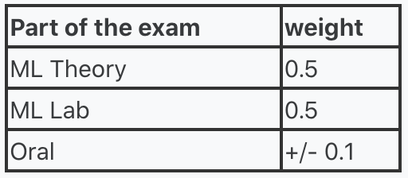
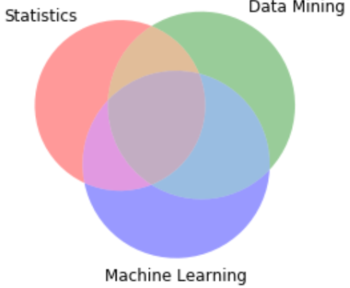
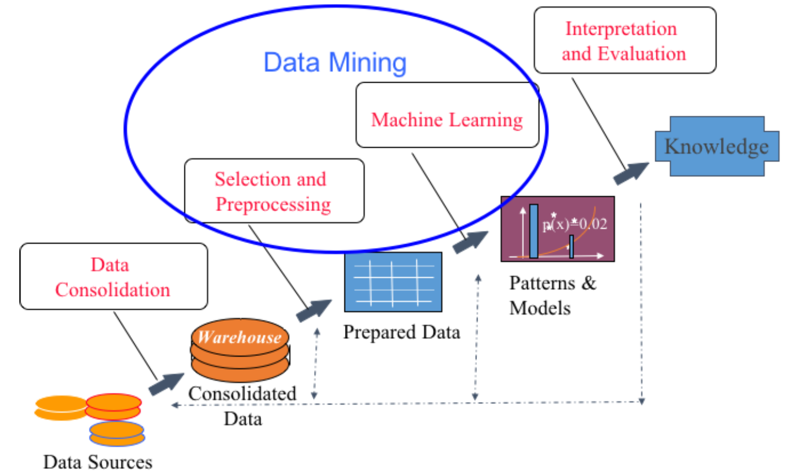
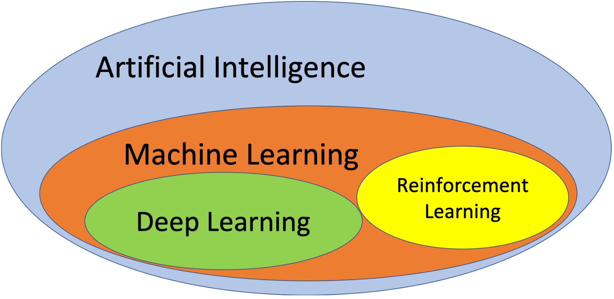

# Machine Learning - prof. Claudio Sartori

Two MsCs, Computer Science and AI.

For CS students, ML is completed with a second module (*Data Mining*), while for AI students this module is part of an integrated course, together with **deep learning** in the second semester.

In any case, the exam for this first module has 3 components:

- Multiple choice test (on Virtuale), 30 mins, approx. 1 question per minute.
- Lab exam, to test the applications of algorithms and techniques. 
- (Optional) Oral exam if wanted by the student.

All the infos can be found on Virtuale. 

Labs are on **Wednesdays**.

### Prerequisites

- **statistics and probability**
- **databases and SQL** 
- **Python**.

## Introduction to ML and Data Mining

Information technology was born around the '60s in early *data collections and databases*. In the following decades, *DataBase Management Systems* were born, got mature, new types of data were introduced, paradigms, insights (people realized that data could even be analysed, *no shit Sherlock*)...

Around 2000, what we call the *Big Data Explosion* happened. 

In the beginning, data were used just **once**, in most of the cases: day by day operations, like bank operations, commercial bills, inventory... 

But, the question is: *can we use the stored data to improve our strategies? Can we learn from data?* We need to see the big picture! The answer is, intuitively, **yes.**

This led to a **data explosion**: data are nowadays automatically collected, instead of manually inserted into a DB. 

***We are drowning in information, but starved for knowledge*** (John Naisbitt)

The idea of learning from data is not new at all, though: in the beginning, there was *statistics*.

They developed powerful techniques to **analyse facts** and find **relations** between them.

**Machine Learning**: field of study that gives a computer the ability to improve its behaviour, without being explicitly programmed! The computer will then learn from new data, examples, and not by *being told*.

**Data Mining**: we mean a computational process which we organize to **discover patterns** in data. We are, of course, interested in large amounts of data. This term is approximately 30 years old, and this *science* uses concepts and tools from *AI, ML, statistics, DBMS*. This tool learns from data, and it is therefore a **data-driven approach**: data are our *power source.* 

Let's define a few terms:

- **Business Intelligence**: it analyses massive amounts of data for business purposes
- **Analytics**: set up when we want to draw some specific conclusions to raw data. E.g. decide if a single credit card transaction is fraudulent
- **Data Science**: this is another useful definition. It is a broader term which includes data mining, ML, business intelligence... It's simply the *science of driving decisions with data*.

This represents the discovery process. It starts from the **data sources**, for example a DBMS or a log. Then, if we want to understand what this data mean, we need to **consolidate them**: the *data warehouse* can be some tool where we collect our data. After the preprocessing, we get the **prepared data**: data which is ready for machine learning. What is machine learning? It allows us to **extract patterns** from the data. After we've extracted these **patterns**, we can derive **knowledge** from those. 

**Data Mining** starts from user-specified objectives. The process is not straightforward, and we're looking for knowledge, expressed as patterns and models. We therefore need algorithms and IT. The last requirement is: **knowledge must be actionable**. It must allow us to do things!

There's this *virtuous loop*: I want to improve my knowledge, start with an **idea**, find a **problem**/opportunity, get my **knowledge**, take data-driven **actions**, measure the **effects**, and **restart** again with another problem!

In the **soybean example**, it is obvious that Machine Learning is so powerful: while expert-defined rules achieved a 75% accuracy on spotting ill plants, a ML approach, trained on examples, achieved an accuracy of 97.5%.

So, the application areas are tremendously vast: **decision support**(*market analysis, risk management, fraud detection*), **data analysis** (*text mining, social mining, image analysis*), **prediction**, **advanced diagnosis and predictive maintenance**.

Then, we go from real world problems (i.e. *business problems*) to computing tasks. This process has stages that drive software development. Fortunately, the possible tasks are not infinite, but at the moment we have several, well-defined tasks. What we'll do is understanding the basic tasks and the algorithms that implement these tasks. 

Some **tasks**, for example, are:

- **Classification** and **class probability** extraction: given an individual, target it with a label
- **Regression**: a linear (continuous, non-discrete) relationship between the input and the output
- **Similarity matching**: for example, which are the companies similar to our best customers? 
- **Clustering**: grouping individuals in a population basing on their similarities 
- **Co-occurence grouping**: attemps to find associations between entitites according to the transactions in which they appear together
- **Profiling**: behavior description, for instance *what is the typical cell phone usage of a customer segment?* Could even be used to detect anomalies.
- **Link analysis**: tries to infer missing connections from the existing ones
- **Data reduction**: when many individuals have thousands of features, replace the set with a subset, preserving the most important informations
- **Casual modeling**: understands what events or actions actually influence others

An example question to ask ourselves is: *do our population naturally fall into different groups?* In this case, there is no specific purpose or target: this is an example of **unsupervised mining**. Another question may be: *can we find groups of customers who have high likelihood of canceling their service soon?* This is a **supervised task.** The techniques are substantially different between the two. Being supervised or not is a characteristic of the problem or the data, not a choice. 

There are two ways of obtaining supervised informations: informations provided by **experts** (as in the soybean example) and **history** (let's say we have logs of customers who canceled their service).

Besides supervised and unsupervised, there's an additional *flavor*: **Reinforcement Learning**, which is used when I have a sequence of actions and I want to obtain a best result. For instance, it is used for self driving vehicles, games... It learns a policy, by trying one, getting a reward, and optimizing it. The focus is **the overall policy**, not the single action. 

Some **software**:

- **Programming** languages
  - **R**: a complete, interpreted language, open source, lots of libraries...
  - **Python**: a complete, interpreted language, open source, growing suite of libraries...
- Open source tools with a **GUI**
  - **Weka**: open source tool with GUI, allows data collection for the entire mining process
  - **RapidMiner**: open source platform
  - **Knime**: open source platform
- **Commercial** software:
  - **SAS**: commercial high-end software
  - **IBM SPSS**
  - **MATLAB**
  - **SQL Server, Oracle...**: DBMSs

So, **what are we going to study?** We'll study **learning functions**, **classification**, **clustering**, **associations**. Sadly, we won't study **deep learning**.

What do we include in ML? Methods studied in the *AI area* since the '50s, methods for *data driven decisions*, and methods from *statistics*.

